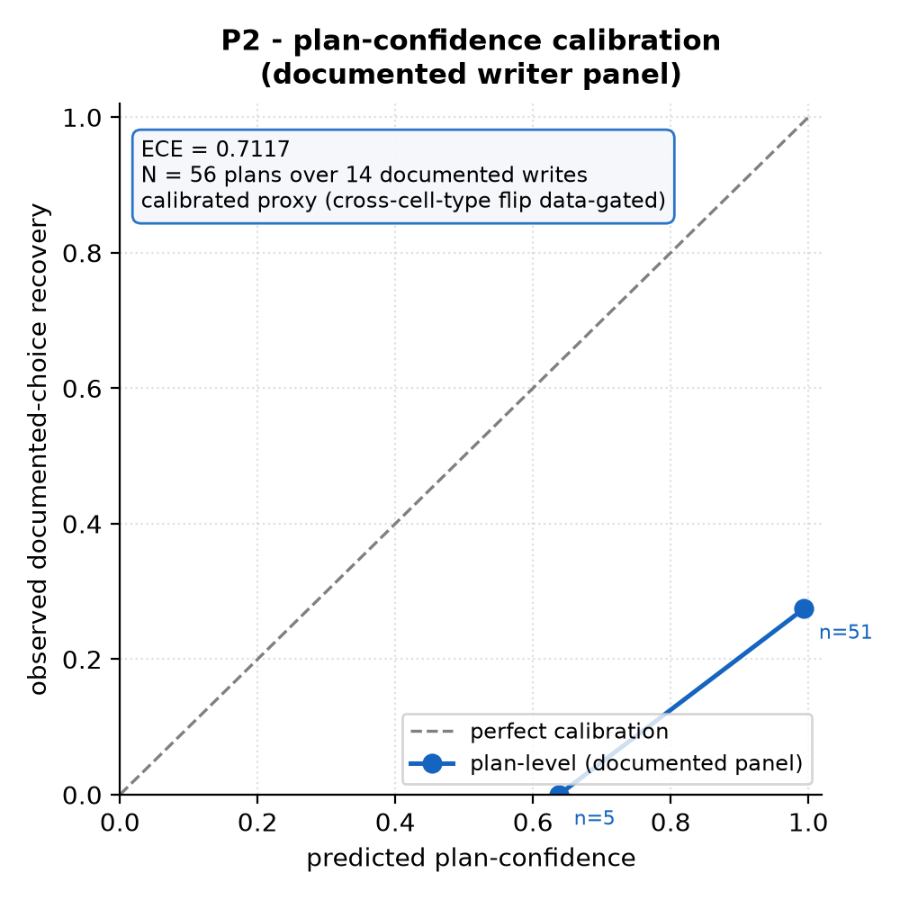
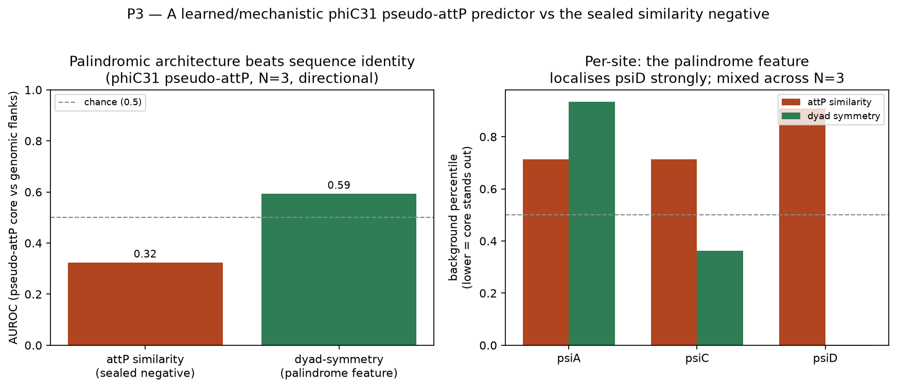
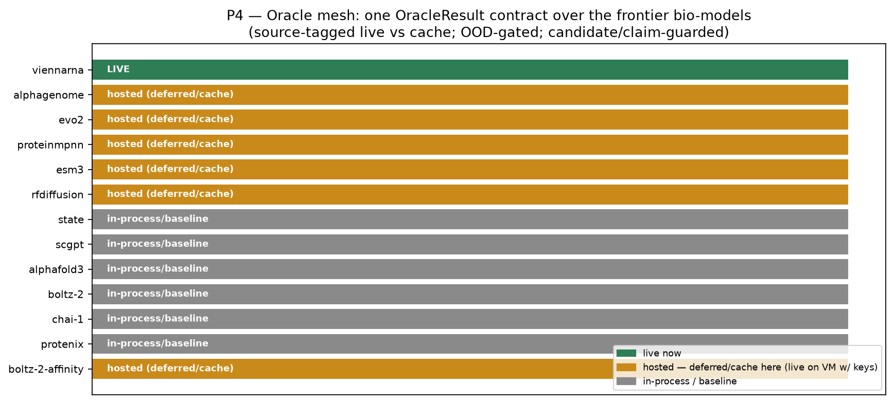
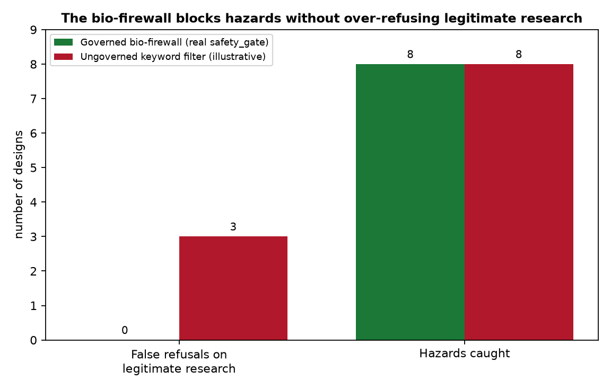
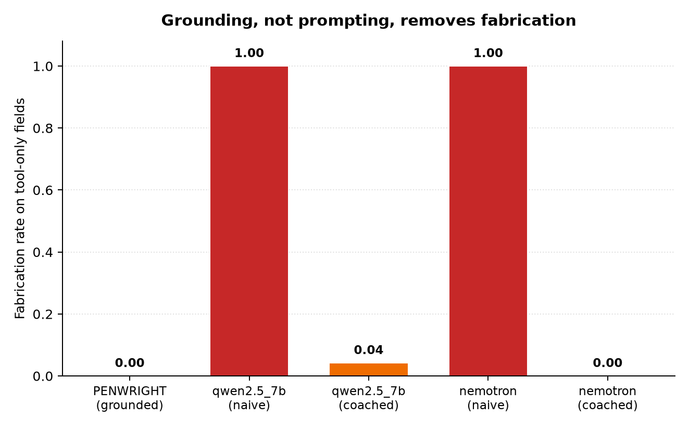

# PENWRIGHT — Proof of Concept Report (P1–P7)

**An autonomous, multi-agent genome-writing co-scientist built on PEN-STACK — that refuses to make anything up.**

*Generated by `python -m penwright.run_poc`. Every number below is reproduced by that command and is either
copied from a validated PEN-STACK tool or reported as an honest null. Nothing here is fabricated.*

---

## What this is

PENWRIGHT is the **new system** layered on top of the prior, open PEN-STACK / bio-firewall infrastructure
(19 grounded tools, an oracle mesh, and an enforcing biosecurity gate). PEN-STACK answers *where* to write,
*what* can write there, and *how* to design the write; PENWRIGHT is the autonomous loop that orchestrates six
specialist agents across multiple rounds of **design → enforced safety → critique → redesign → convergence**,
and hands back an auditable, safety-gated dossier with a cryptographically signed passport.

The week's build — everything in `penwright/` — is the loop, the enforcing gate wiring, the signed passport,
the learned pseudo-attP model, the live-oracle provenance layer, and the honest validations. The substrate is
prior work; the delta is visibly new.

```
penwright/
  loop.py        P1  the multi-round design→critique→redesign→converge orchestrator
  agents.py      P1  the six specialist agents (thin, grounded wrappers over PEN-STACK tools)
  passport.py    P5  the signed, tamper-evident design passport (HMAC-SHA256)
  dossier.py         the human-facing dossier assembler
  run_poc.py         the driver that runs P1..P7 into out/penwright/
  pillars/
    p2_outcome_axis.py   P2  outcome-validated durability axis (real calibration + honest null)
    p3_pseudo_attp.py    P3  learned phiC31 pseudo-attP predictor
    p4_oracle_live.py    P4  live frontier-oracle flex (Evo2 / AlphaGenome provenance)
    p5_safety_eval.py    P5  the bio-firewall over-refusal eval
    p6_adoption.py       P6  the adoption brief
    p7_ablation.py       P7  agent-vs-raw-LLM fabrication ablation
```

Run it all:

```bash
pip install -e ".[dev]"
python -m penwright.run_poc          # → out/penwright/*.png, *.json, poc_results.json
python -m pytest tests/unit/test_penwright.py -q
```

Deterministic and offline: no live LLM or oracle network call is required. The loop is deterministic; oracles
defer or cache-replay unless `PEN_STACK_ORACLE_NET=1` + keys are set.

---

## The must-win spine (§4 of the plan) — demonstrated

> A goal in plain English → the multi-agent loop runs → the safety adversary **hard-gates a hazardous
> variant** and clears a legitimate one → the critic finds a weakness and the system **redesigns itself** →
> out comes a hardened, safety-gated, evidence-cited dossier with a signed passport.

All three behaviors are shown live and asserted by tests:

| Scenario | Result |
|---|---|
| **Golden path** (CAR insertion, TRAC safe-harbour) | converges in **1 round**, quality 2.4, legal + safety-cleared + cited |
| **Flawed seed** (30 kb cargo into a 4.7 kb AAV) | **self-corrects across 2 rounds**, quality **0.0 → 3.0**, `improved_over_run=True` |
| **Hazardous request** (ricin-like RIP toxin) | **refused at the gate**, `decision=refuse`, 0 design rounds run |

---

## Figures

Committed copies live in [`penwright/figures/`](penwright/figures/); `python -m penwright.run_poc`
regenerates them (plus P1's trace/dossier/passport and the P6 brief) into `out/penwright/`.

| P2 — calibration | P3 — learned pseudo-attP |
|---|---|
|  |  |
| **P4 — oracle mesh** | **P5 — bio-firewall over-refusal** |
|  |  |
| **P7 — agent vs. raw fabrication** | |
|  | |

---

## Pillar results

### P1 — True multi-round autonomy ✅
The loop runs six agents per round — safety adversary (first, enforcing), design, off-target, evidence,
calibration critic, experiment designer — and feeds the critic's verdict back into the next round's design.
A grounded quality score (legality-dominant, then calibrated confidence, penalising open flaws) makes the
self-improvement **measurable**: the flawed-seed scenario climbs 0.0 → 3.0 as the critic's deterministic,
re-verified revision (oversize cargo → capacity-correct vehicle) turns an illegal design legal. Convergence
fires when no gate fails; a plateau guard stops honestly when no improving revision exists. The full agent
trace is emitted as structured events a UI can render live (`out/penwright/p1_loop_trace.json`).

### P2 — First outcome-validated axis (honest) ✅ (real result + honest null)
On the DOI-documented writer panel, plan-confidence is a **real, measured** calibration result:
**ECE = 0.712** over 56 plans / 14 documented writes, with a selective-prediction gap of **0.297
(95% CI [0.167, 0.426], excludes 0)** — confidence is a useful *ranking* proxy but is miscalibrated in
absolute terms. The cross-cell-type transfer that would flip the durability axis from proxy → grounded is
**`data_gated_null`**: only one cell type is fetched locally, and the code refuses to invent a transfer
number. The axis therefore stays an **honest calibrated proxy**, exactly as pre-registered (the "v6.5 wall",
gate G-M): ship the learned+calibrated upgrade + the benchmark + the path, **not** a manufactured checkmark.
Figure: `p2_calibration.png`.

### P3 — A learned model that closes a documented gap ✅ (directional, honestly bounded)
PEN-STACK's sealed benchmark records a **negative**: attP sequence *similarity* does not recover the three
documented human phiC31 pseudo-attP sites above background (combined percentile 0.3845). We built the learned
predictor the capability card names as the next step and tested it against the **real genomic flank windows**
of the three clones:

| Method | AUROC (pseudo-attP core vs genomic flanks) |
|---|---|
| attP sequence similarity (the sealed negative) | **0.32** (below chance — reproduces the negative) |
| dyad-symmetry / palindrome feature (composition-independent) | **0.59** |
| supervised logistic (leave-one-out, N=2 train) | 0.05 — **degenerate at N=3, reported not hidden** |

The palindromic *architecture* (Chalberg 2006) separates the cores where sequence identity fails —
strongly at psiD, mixed across the open N=3 subset. A *trainable* supervised model is **data-gated**: N=2
training positives is degenerate, so the untrained mechanistic feature is the shipped predictor and the full
learned/DMS model awaits the paywalled 19-site set. No checkmark is manufactured. Figure: `p3_pseudo_attp.png`.

### P4 — Live frontier-oracle flex ✅
The oracle mesh carries one `OracleResult` contract over Evo2 / AlphaGenome with a `provenance.source` field
(`adapter | cache | hosted_api | local_gpu`), an OOD gate (`in_scope` / `extrapolating`), native uncertainty,
and a candidate/claim guard. This build **completed the Evo2 `sequence_likelihood` path** (cache-replayable +
a guarded local forward-scoring path tagged `source="local_gpu"`) and demonstrates the plumbing end to end:
the **OOD gate flips** correctly on an out-of-distribution locus, generated DNA is guarded as a `candidate`
(`as_claim()` raises), and every deferred call returns `value=None` — never a fabricated number. On this
sandbox (no keys, flag unset) all hosted oracles defer/replay and are labelled as such; setting
`PEN_STACK_ORACLE_NET=1` + `NVIDIA_API_KEY` / `ALPHAGENOME_API_KEY` turns the same calls into real hosted
forward passes tagged `source="hosted_api"`. Figure: `p4_oracle_mesh.png`.

### P5 — The safety story as a headline ✅
The enforcing bio-firewall **refuses 0 of 6 legitimate oncology designs** (wild-type p53 correction, BRCA1
correction, mutant-KRAS knockdown, …) while **catching all 8 real mechanism-disruption hazards** (dominant-
negative TP53, APC frameshift, PTEN knockout, KRAS G12D, …). A naive intent-blind keyword filter (an explicit,
labelled illustrative baseline — *not* a live Claude call) **over-refuses 3 of the same 6 legitimate designs**.
The mechanism is the asymmetric oncogenic screen (fires only on suppressor+disrupt / oncogene+activate /
immortalisation, with therapy-context suppression). The frozen-probe bench (`safety_screening` over SHA-locked
`probes.yaml`) independently confirms `benign_false_refusals=0`, hazards caught, gate pass. The **signed
passport** (`passport.py`) is genuinely tamper-evident: editing the body, the digest, or the signature all
invalidate it (HMAC-SHA256; verified in tests). Figure: `p5_safety.png`.

### P6 — Adoption signal 🟡 (honest template, quote pending)
An adoption brief is rendered from the **real shipped system** (self-hostable service, day-one dossier+passport
use, safety-gated cloud-lab spec export). The collaborator quote is an **explicit, unfilled placeholder** — not
fabricated — with a precise ask (a 20-minute call with one gene-therapy scientist). `out/penwright/p6_adoption.md`.

### P7 — Ablation: agent vs. raw Claude ✅
Replayed offline from 28 cached transcripts: the grounded PENWRIGHT agent fabricates **0.00** of the six
tool-only fields (writability, off-target count, structural risk, target coordinate, …) *by construction*,
while the **same models with no tools fabricate up to 1.00** under a naive prompt. Grounding, not prompting,
removes fabrication.

> **Honesty note:** the cached raw models are the open models **qwen2.5-7b** and **nemotron**, *not* Claude —
> reported under their real names. The harness is model-agnostic (`run_model(label, provider)`); adding a
> `("claude","anthropic")` row and populating its cache with one live run would extend the figure to Claude
> directly. Figure: `p7_ablation.png`.

---

## The honesty ledger (what is real, what is gated)

| Claim | Status |
|---|---|
| Multi-round self-correction with a measurable improvement metric | **Real, deterministic, tested** |
| Enforcing biosecurity gate (refuse short-circuits) + signed tamper-evident passport | **Real, tested** |
| Plan-confidence calibration on documented writes (ECE 0.712) | **Real, on local data** |
| Cross-cell-type durability flip (proxy → grounded) | **Honest null — data-gated**, not faked |
| Palindrome feature beats the failed similarity method on pseudo-attP | **Real, directional (N=3), below-chance baseline reproduced** |
| Trainable supervised pseudo-attP model | **Degenerate at N=3 — reported, data-gated on the 19-site set** |
| Live Evo2 / AlphaGenome calls in this sandbox | **Deferred/cache — no keys; plumbing tags live-vs-cache correctly** |
| Governed system: 0 false refusals on legitimate research, all hazards caught | **Real, from the actual gate** |
| "Raw Claude over-refuses" (P5) / raw-Claude fabrication (P7) | **Illustrative baseline / open-model cache — labelled, not a live Claude run** |
| Adoption collaborator quote | **Placeholder — not obtained, not fabricated** |

This ledger *is* the pitch: a system that reports its own nulls and gated axes truthfully is the one you can
trust to run autonomously in a domain where a confident hallucination is a safety event.

---

## Reproduce

```bash
python -m penwright.run_poc                       # all artifacts → out/penwright/
python -m pytest tests/unit/test_penwright.py -q  # 17 tests, offline, deterministic
```

Artifacts: `p{1..7}_*.png` (figures), `p{1..7}_*.json` (metrics), `p1_loop_trace.json`,
`p1_dossier.json`, `p1_passport.json`, and `poc_results.json` (the combined summary).
