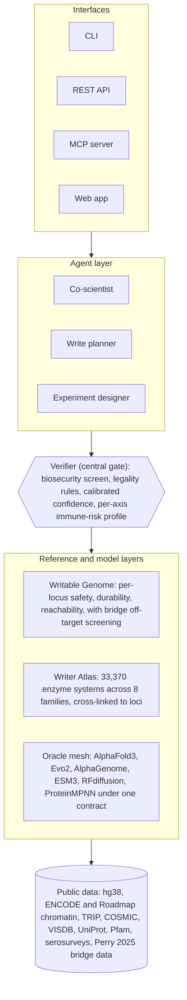

<div align="center">

# PEN-STACK

### A verification and grounding layer for genome-writing AI

Foundation models generate candidate edits; PEN-STACK checks them. It tells you where in the genome a write can be made safely and durably, which enzyme can make it, and how to design the write end to end. Every design is checked against rule-grounded mechanism, returned with calibrated confidence and its provenance, and marked "out of scope" rather than guessed. Numbers come from validated tools, not from a language model.

[](https://pypi.org/project/pen-stack/)
[](https://github.com/ahmedanees-m/pen-stack/actions/workflows/ci.yml)
[](https://github.com/ahmedanees-m/pen-stack/actions/workflows/publish.yml)
[](https://codecov.io/gh/ahmedanees-m/pen-stack)
[](LICENSE)
[](https://www.python.org/)
[](docker/)

</div>

## Overview

PEN-STACK is an installable Python package and service for the genome-*writing* era, the modality that installs new information into a genome (inserting genes, flipping or excising kilobases, placing programmable landing pads) rather than editing a base in place. Writing is harder and less tooled than editing, and it is gated by questions that have no canonical answer: where can you write, what can write there, and how should the write be designed.

The package consolidates five earlier research projects into one citable stack and adds the reference maps and the design engine the field was missing. It runs on a single GPU, uses bulk-downloadable public data, and is validated against pre-registered baselines.

See the [CHANGELOG](CHANGELOG.md) for release history and [docs/](docs/) for the full documentation.

## What it addresses

| Question | The situation today | What PEN-STACK provides |
|---|---|---|
| Where can you write? | Labs re-derive ad-hoc "safe harbour" shortlists from inconsistent criteria; published lists range from thousands of sites to a few dozen, rarely predict expression durability, and usually cover one cell type. | The Writable Genome: a learned, cell-type-aware, writer-aware atlas scoring every locus for safety (genotoxicity risk), durability (whether a cassette stays expressed), and reachability (which enzyme can engage it). |
| What can write there, and how well? | Enzyme capabilities are scattered across papers, with no catalogue placing the genome-writing families on common measured axes with their targeting requirements. | The Writer Atlas: 33,370 enzyme systems across 8 families on common measured axes, joined to the Writable Genome by a bidirectional cross-link. |
| How do I design the write? | Destination, enzyme, cargo, and delivery are interdependent and goal-dependent, and no tool optimises them together. | The Write Planner: inverse design that, given a goal and an edit intent, returns ranked, traceable site, writer, cargo, and delivery plans. |
| Where might a bridge-recombinase design go off-target? | Bridge recombinases are highly programmable but had no genome-wide off-target screening tool. | A bridge off-target engine that nominates and ranks candidate off-target locations from measured data (a screen, not a per-site risk calculator). |

## Architecture

A goal enters through one of the interfaces. The agent layer turns it into candidate designs. Every candidate passes through the verifier, the central gate: it runs a biosecurity screen first, checks the design against the rule base, attaches a calibrated confidence and a per-axis immune-risk profile, and discards anything that is unsafe, illegal, or uncalibrated. The reference layers and the oracle mesh supply the grounded answers the verifier and planner rely on, and everything rests on public data. No value is reported without a traceable source.



## Components

| Component | Module | What it does |
|---|---|---|
| Writable Genome | `pen_stack.wgenome` | Learned per-locus safety, durability, and reachability; 3D structural-risk axis; bridge off-target screening. |
| Writer Atlas | `pen_stack.atlas`, `.mech`, `.score` | Cross-family enzyme catalogue and Writer-Targeting knowledge base, cross-linked to loci. |
| Write Planner | `pen_stack.planner` | Inverse design conditioned on an edit intent, including the delivery palette and the delivery-immunology profile. |
| Verifier | `pen_stack.verify`, `pen_stack.rules` | `verify(design)` returns legality, biosecurity verdict, calibrated confidence, and the immune-risk profile as distinct axes. |
| Biosecurity gate | `pen_stack.safety` | A dual-use screening gate that runs first in `verify()`; a refusal short-circuits scoring, with a tamper-evident audit trail. |
| Oracle mesh | `pen_stack.oracles` | One `OracleResult` contract over the biomolecular foundation models, with provenance, native uncertainty, and a scope card; generated output is a candidate, out-of-distribution inputs are flagged. |
| World-model graph | `pen_stack.graph` | A typed, provenanced knowledge graph with a gated, propose-only update loop. |
| Generative designer | `pen_stack.design` | Proposes candidate writing systems and keeps only those that pass safety, legality, and calibration, returning a Pareto frontier. |
| Digital twin | `pen_stack.twin` | Calibrated, out-of-distribution-gated outcome prediction, bounded at phenotype. |
| Experiment designer | `pen_stack.active` | Active learning by expected information gain, with a retrospective active-versus-random evaluation. |
| Build interface | `pen_stack.build` | Safety-gated protocol export (draft only, never auto-run) and gated ingestion of results, with a cloud-lab connector that runs the biosecurity gate before any submission. |
| Closed loop | `pen_stack.loop`, `pen_stack.active` | A gated design, build, test, learn loop with drift detection and versioned, reversible recalibration; an SDL-brain benchmark and a validation-campaign engine that orders the most-informative next measurements by expected information gain. |
| Write intent (WriteSpec) | `pen_stack.spec` | A typed, ontology-backed `WriteRequest` (an SBOL3 profile) with a grounded extractor that resolves free text to verified ontology ids, asks clarifying questions on ambiguity, and runs a SAT feasibility check. |
| Agent, co-scientist, and chat | `pen_stack.agent`, `pen_stack.web`, `pen_stack.rag` | Goal to cited, auditable plan; MCP server; the co-scientist that drives the loop; and the grounded conversational chat (four lanes: design, explain, meta, general; provenance-tagged retrieval; a swappable LLM provider). |
| Bridge off-target engine | `pen_stack.bridge` | Off-target nomination and guide QC for bridge recombinases. |
| Interfaces | `pen_stack.server`, `pen_stack.web`, `pen_stack.ui`, `pen_stack.cli` | REST API, web application, and command-line tools. |

## Key results

All results are blind and pre-registered (success criteria, baselines, and held-out sets are SHA-locked in [`prereg/`](prereg/) before any model sees the test data). Estimates are reported with their sample size and confidence interval.

- **Writable Genome.** A genome-wide atlas of 3,031,030 loci across 3 cell types (K562, HepG2, CD34+ HSPC) recovers validated safe harbours as highly writable and clinical genotoxic loci as non-writable, blind. Durability transfers from mouse to human (Spearman rho 0.42).
- **Writer Atlas.** 33,370 enzyme systems across 8 families on common measured axes; the mechanism classifier agrees with the audited labels on the curated core (1.00); the cross-link is validated on AAVS1.
- **Write Planner.** Run genome-wide so that no on-target identity term fires, the planner's writability ranks held-out safe harbours above matched-context controls. On a gold set of 16 loci (8 functionally validated, 8 computationally defined) this is a weak, bounded signal: all-loci AUROC 0.68 (95% CI 0.53 to 0.82), validated-only 0.70 (95% CI 0.48 to 0.91, underpowered at N=8) against a safety-only baseline of 0.51. Writer-family recovery at rank 1 is 0.86 against a prevalence of 0.29 across 4 families.
- **Bridge off-target engine.** To our knowledge the first measured-data-validated tool that nominates and ranks candidate off-target locations for bridge recombinases. On the Perry 2025 data (6,856 measured off-targets) the per-position profile confirms the central core (positions 7 to 9) as the specificity determinant, and the model ranks real off-targets above core-disrupted decoys at AUROC 0.77 against 0.62 for Hamming distance. It is a screening tool, not a quantitative safety calculator: it does not quantify how much recombination occurs at each site.

## Installation

From PyPI (the library, CLI, agent, and pure-logic tools):

```bash
pip install pen-stack                                          # core
pip install "pen-stack[models,bio,bridge,server,services]"     # full stack
```

The wheel ships the importable package and the command-line tools. The full data pipeline (the multi-million-row atlases, BigWig tracks, and curated configs) is distributed via the cloned repository and Zenodo. Most users who want the whole pipeline clone the repository:

```bash
git clone https://github.com/ahmedanees-m/pen-stack.git && cd pen-stack
pip install -e ".[dev]"                                        # core and tests
pip install -e ".[models,bio,bridge,server,services]"          # full stack
pytest -q
pen-stack info                                                 # stack status
python bench/run.py --agent                                    # run the Genome-Writing Bench
```

## Quick start

Query the stack from the command line:

```bash
pen-stack atlas --coverage                                     # Writer Atlas coverage (33,370 systems, 8 families)
pen-stack writable --gene CCR5 --ct k562                       # rank writable loci near a gene
pen-stack crosslink --chrom chr19 --bin 55090                  # which writers reach AAVS1
pen-stack plan --gene TRAC --intent knock_in_with_disruption --cargo-bp 2000
pen-bridge design --target ACGTGTCTACGTGA --donor TTGCATCTAGGCAC
```

Self-host the whole platform (API, web app, agent, MCP, LLM) with one command:

```bash
docker compose up -d
docker compose exec ollama ollama pull qwen2.5:7b-instruct     # first run only (local fallback model)
# Web app on :8501, API on :8000, MCP on :8765 (see docs/DEPLOY.md)
```

The LLM backend is optional and non-load-bearing: it narrates and routes, but every number and citation comes from a validated tool, so the core scientific compute runs with no language model at all. See [docs/DEPLOY.md](docs/DEPLOY.md).

## Benchmarks

The Genome-Writing Bench is a one-command, SHA-locked benchmark for the writing side of genome engineering: where to write, what writer to use, how to design the cargo, and what off-target or structural risk a write carries. Each task has a deterministic scorer and a documented ground-truth source, and no task is scored against a circular label.

```bash
python bench/run.py --agent
docker compose run --rm bench python bench/run.py --agent       # on the clean image
```

The deterministic planner beats the naive baselines on the grounded tasks; a tool-using LLM agent reaches the planner's numbers only by grounding every value (zero fabricated), while the same models with no tools fabricate the tool-only fields. See [`benchmarks/genome_writing_bench/`](benchmarks/genome_writing_bench/). The held-out public leaderboard is the [Genome-Writing Challenge](benchmarks/genome_writing_challenge/).

## Built on prior repositories

PEN-STACK consolidates and re-grounds five earlier projects. Their reusable assets are imported here; the originals are archived read-only for provenance and DOI stability.

| Repository | Pinned version | What is reused | What changed |
|---|---|---|---|
| [genome-atlas](https://github.com/ahmedanees-m/genome-atlas) | v0.7.2 | The audited 18-family Pfam backbone behind the knowledge base and the at-scale mechanism classifier. | The GraphSAGE link-prediction framing was retired. |
| [mech-class](https://github.com/ahmedanees-m/mech-class) | v0.5.4 | The mechanism classifier (Pfam, RHEA, CRISPRcasdb, UniProt). | Reused as the family and mechanism caller. |
| [pen-score](https://github.com/ahmedanees-m/pen-score) | v0.1.3 | The scoring axes (delivery, immunogenicity, cargo, and others). | The cargo and programmability axes were re-grounded; hand-set overrides removed. |
| [pen-assemble](https://github.com/ahmedanees-m/pen-assemble) | v0.5.2 | The ortholog sequence set. | De-novo chimera generation was replaced by DMS-grounded point-variant proposal. |
| [pen-compare](https://github.com/ahmedanees-m/pen-compare) | v0.1.0 | The 1,058-entity universe, scorecard scaffold, and tests. | The circular five-gate certification became a descriptive scorecard with blind concordance. |

A single assembly path (`pen_stack/atlas/universe.py`) feeds the classifier, the scorer, and the scorecard the same metadata, so cross-module inconsistencies cannot recur.

## Repository structure

```
pen-stack/
  pen_stack/            the installable package
    spec/               WriteSpec: typed SBOL3-profile intent layer, grounded extractor, ontology resolvers, SAT feasibility
    wgenome/            Writable Genome: features, safety, durability, writability, uncertainty, structure3d, off-target nomination
    atlas/              Writer Atlas, knowledge base, cross-link, variant proposal, canonical universe, writer-efficiency predictor
    mech/  score/       mechanism classification at scale; re-grounded therapeutic-readiness axes
    planner/            Write Planner: optimisation, cargo, routing, delivery palette, delivery immunology, capsid fitness
    bridge/             bridge off-target engine and guide QC
    oracles/            oracle mesh: the OracleResult contract and adapters over the foundation models, with binding-affinity and per-oracle reliability
    graph/              living world-model knowledge graph (gated, propose-only)
    rules/  verify/     machine-readable rule base, the verify(design) service, and the proof-object with repair hints
    safety/             the biosecurity and dual-use gate, with standards concordance
    design/  twin/      generative designer; calibrated digital twin with a learned position-effect model
    active/  build/     experiment designer with the SDL-brain benchmark and validation-campaign engine; safety-gated build interface and cloud-lab connector
    loop/               the gated design-build-test-learn loop
    rag/                PEN-CHAT: provenance-tagged retrieval corpus, embedder, and four-branch ground router (social, cited, general, abstained)
    agent/              agent platform, co-scientist, MCP server
    api/  web/  server/ ui/  cli.py    AI integration surface, web platform with the grounded chat and swappable LLM provider, REST API, CLI
  benchmarks/           Genome-Writing Bench and the public Genome-Writing Challenge
  scripts/              reproducible pipeline drivers
  configs/              pinned datasets, thresholds, and curation (YAML)
  prereg/               SHA-locked success criteria
  data/curated/         small committed tables
  tests/                unit, regression, and blind-validation suite
  docs/                 documentation site
  docker/               container images and pinned requirements
  docker-compose.yml    one-command self-hostable platform
```

Large artifacts (multi-million-row atlases, BigWig tracks, models) and any third-party copyrighted data are not committed. They are released via Zenodo or fetched from the original source and are reproducible by re-running the scripts. Only small curated tables and derived products live in git.

## Data sources

All public: hg38 (UCSC); ENCODE and Roadmap chromatin (ATAC/DNase and histone marks for K562, HepG2, CD34+ progenitor, mouse ES-Bruce4); GENCODE v46; COSMIC Cancer Gene Census v104; DepMap Public 26Q1; LaFave 2014 MLV integrations; VISDB; TRIP (Akhtar 2013, GEO GSE49806/49807); UniProt orthologs; Pfam and InterPro; Europe PMC; Addgene; and the Perry 2025 bridge-recombinase off-target and DMS data (copyrighted, kept local, only derived products released). Every accession and DOI is pinned in `configs/datasets.yaml` and independently verified.

## Validation approach

- Pre-register before training: success criteria, baselines, and held-out sets are SHA-locked in `prereg/` before any model sees test data.
- Always report a baseline (oncogene distance for safety, H3K9me3/LAD for durability, intent-blind ranking for the planner, Hamming distance for the bridge engine).
- Blind external concordance: recover validated safe harbours, clinical genotoxic loci, documented writes, and measured off-targets the model never trained on.
- Report failure: cross-cell-type degradation, small benchmark sizes, and the limits of sequence-only off-target magnitude prediction are reported as results, not footnotes.
- Every estimate carries its sample size and confidence interval. The validated gold sets are small, and statistical power is a stated limitation; scaling them is the top priority for turning the proof of concept into an adopted resource.
- Grounded services: every quantitative answer comes from a validated tool call, never a language model; the living database never auto-edits the atlas; clinical directives are refused.

## Citation

```bibtex
@software{penstack2026,
  author  = {Mahaboob Ali, Anees Ahmed},
  title   = {PEN-STACK: open infrastructure for genome writing (The Writable Genome)},
  year    = {2026},
  version = {7.1.2},
  url     = {https://github.com/ahmedanees-m/pen-stack}
}
```

Author: Anees Ahmed Mahaboob Ali, VIT University, Vellore. MIT licensed.

Decision-support, not a clinical directive. Every score is traceable to public data and a pre-registered model.
